# GuitarProVST3 运行逻辑与介入逻辑总图

本文按当前工作树绘制插件从加载、校验、扫描、选择、实例准备、实时处理、原生 editor、状态持久化到退出的完整路径。图中的“当前实现”以 `native/` 源码为准；计划文档中尚未落地的行为不画成已实现能力。

## 阅读约定

- **控制线程**：Qt 主线程、扫描线程和 selection worker，负责文件、VST3 factory、实例创建、状态恢复、UI 和链交接。
- **实时线程**：Guitar Pro 的 Master、音轨 DSP、PortAudio callback。只读取已发布的实例/参数/缓冲区，不创建 Qt 对象、不扫描磁盘。
- **editor 线程**：每个打开的 VST3 view 使用独立持久线程执行可能阻塞的 editor contract；Qt 主线程继续泵事件。
- **实线**：音频或控制数据实际流转；**虚线**：诊断、状态或证据流。
- `global`、`track`、P13 `input` 是三套独立范围。下文原有 live-input copy 图仅描述显式 P4 兼容路由，它是 global 选择的独立实例副本；P13 不参与该参数/state 镜像。

## P13 独立输入入口

普通构建新增“输入 VST3”窗口和独立 `input` 持久化范围。ASIO 生命周期代理提供 generation、rate revision 与实际 rate；`MonitorExchange` 在块边界发布槽位、原生监听分流和故障状态。listener 接收原 capture 并继续维护 DSP/电平，其末端输出进入独占 sink；共享 output SRC/ring 按有限历史排空后，input VST3 的结果才叠加到原 GP/RSE output。RSE 的原有 Master/track/global 顺序保持。

```text
真实 ASIO capture → 独立 input VST3 → 输入增益 ─────┐
RSE → 原生音轨/track VST3 → Master/global → SRC ──┴→ 设备输出
原生 input listener → 独立 sink（保持 DSP、电平更新）
```

首次准备失败保留原路由，已激活后处理失败丢弃输入贡献；关闭时停止 overlay 并恢复原生监听路由。新流重新核对合同，受限流不继承旧抑制。普通构建只接受已经核对的 192000 Hz ASIO 与 GP 内部 44100 Hz SRC 拓扑；真实设备范围、尾音/逐样本/延迟和发布证据见 [P13 实现记录](P13_IMPLEMENTATION.md)。以下 P4 图示中的 global→input 同步与 dry fallback 不适用于该模式。

## 1. 系统边界与三条介入面

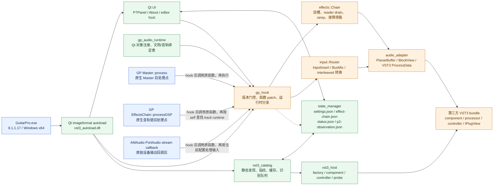

### 介入点清单

| 介入层 | 当前入口 | 介入位置 | 作用 |
| --- | --- | --- | --- |
| 加载介入 | `GuitarProVst3Autoload` | Qt imageformat plugin 构造函数 | 只在进程名为 `GuitarPro` 时排队初始化，并用 `gpvst3P0Scheduled` 防重复 |
| Master 音频介入 | `masterProcessHook` | `Master::process` 原函数返回后 | 读取 GP `AudioBuffer`，执行 global chain，失败时写回旁路数据 |
| 音轨音频介入 | `dspProcessHook` | `EffectsChain::processDSP` 原函数返回后 | 用 `self` 查找已发布的 track runtime，执行对应音轨链 |
| 设备输入介入 | `streamCallbackHook` | PortAudio 原 callback 返回后 | 读取 interleaved input/output，执行 live-input 路由并写回设备 output |
| 音轨上下文介入 | `gp_audio::initialize/refresh` | Qt event filter、Qt 对象注册回调 | 发现文档、音轨、`EffectsChain` 和当前选中音轨，发布稳定绑定表 |
| UI 介入 | `P7Panel` / `About` | GP 原生侧栏和工具栏 | 选择、排序、旁路、参数保存、editor 入口、启动开关 |
| editor 介入 | `RuntimeEffect::openEditor` | Qt HWND 子窗口 + editor worker | 建立 VST3 `IPlugView`，不停止音频实例 |

## 2. 从进程启动到退出的全链路

```mermaid
sequenceDiagram
    participant GP as GuitarPro.exe
    participant Qt as Qt/QImageIOPlugin
    participant Boot as bootstrap
    participant State as state_manager
    participant Hook as gp_hook
    participant Catalog as vst3_catalog
    participant UI as P7Panel/About
    participant Audio as GP 音频回调

    GP->>Qt: 加载 imageformats/guitarpro_vst3_autoload.dll
    Qt->>Qt: 检查进程名、单次调度、singleShot(0)
    Qt->>Boot: initialize()
    Boot->>State: pluginEnabled()
    alt 启动开关关闭
        Boot->>UI: 清空控制回调、扫描状态=disabled
        Boot-->>Qt: 只写 status，退出初始化
    else 启动开关开启
        Boot->>State: disableAllEffectsAtStartup()
        Note over State: 将持久化 enabled 清为 false，保留 desired_enabled 和 state bytes
        Boot->>Hook: gp_audio.initialize(); hook::prepare(host)
        Hook->>Hook: host hash + export + prologue gate
        Hook-->>Boot: installed / bypass / reason
        Boot->>Hook: refreshTrackContext()
        Boot->>UI: 注入 selection、editor、旁路、扫描回调
        Boot->>Catalog: beginAsync(hostSupported)
        Boot->>Qt: 启动按需 scan poll(100ms) 与事件合并刷新
        Qt->>UI: showEffectChainPanel(false)
    end
    loop 运行期间
        Qt->>Catalog: pollVst3()
        Qt->>Hook: refreshTrackContext()
        Qt->>State: writeObservation()（状态变化时替换文件）
        Audio->>Hook: Master / DSP / stream callback
    end
    GP-->>Qt: aboutToQuit / post routine
    Qt->>Catalog: shutdownScan()
    Qt->>UI: shutdownEditors()
    Qt->>Hook: hook::shutdown()
    Qt->>Hook: remove patch、旁路、deactivate、销毁实例
    Qt->>State: 最终写入 p2-observation.json
```

## 3. 启动门控与 hook 安装

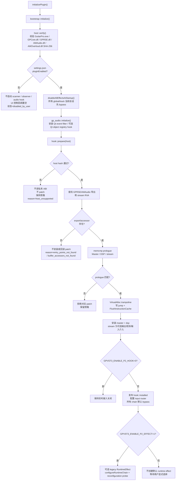

门控有三层：

1. **插件启动开关**：`settings.json` 关闭时不启动扫描、观测和音频 hook。
2. **宿主版本门控**：五个宿主文件的 SHA-256 必须全部匹配；否则私有 ABI 不触碰。
3. **函数级门控**：导出地址、stream RVA、函数 prologue 必须满足当前版本；失败会回滚已经写入的 patch。

## 4. 插件发现、缓存与后台识别

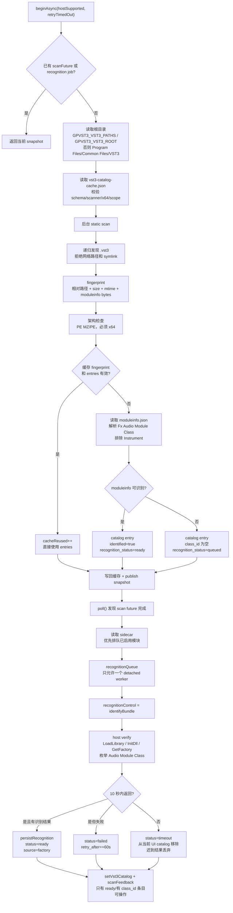

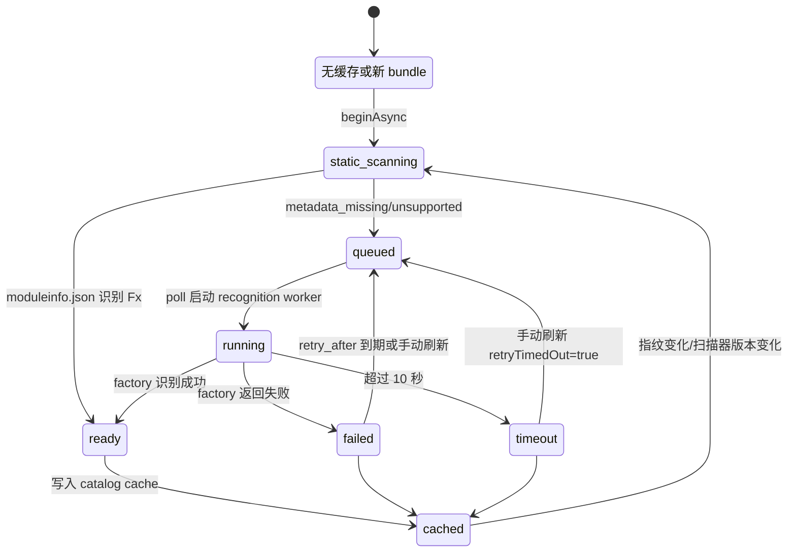

静态扫描只读文件；真正的第三方 `LoadLibrary`、factory 和生命周期识别只发生在显式识别或用户选择准备路径。识别超时没有第三方取消 ABI，worker 会脱离队列，迟到结果不会重新进入当前 catalog。

## 5. UI 选择、持久化和 selection worker

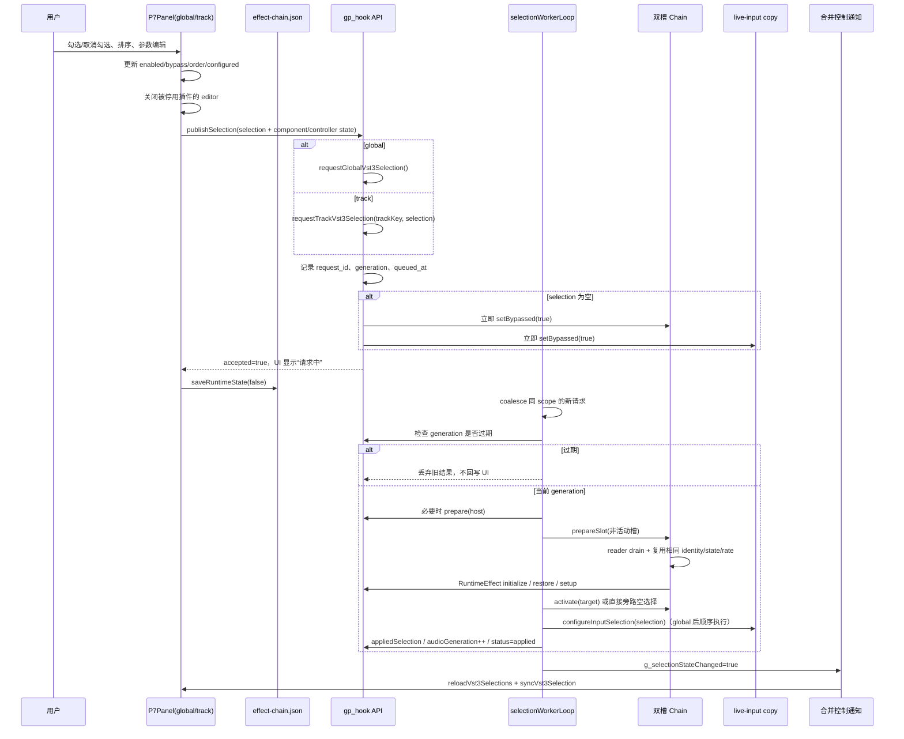

### 选择状态机

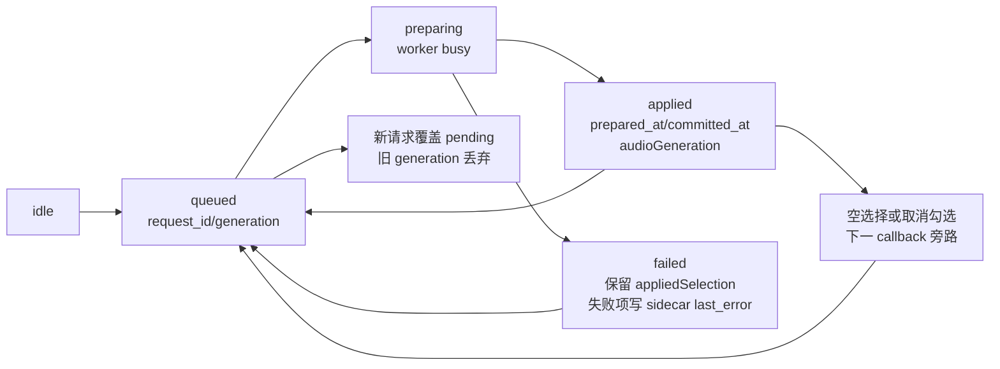

P4 兼容路由中，global 成功后先 `configureSelectedChain`，再 `configureInputSelection`；两条链使用同一 worker 但不是单个原子提交。若 global 成功而 legacy input 准备失败，状态字段和各链旁路结果必须以 `p2-observation.json` 为准。P13 独立 input 请求和配置不走该关联。

### UI 挂载和用户动作

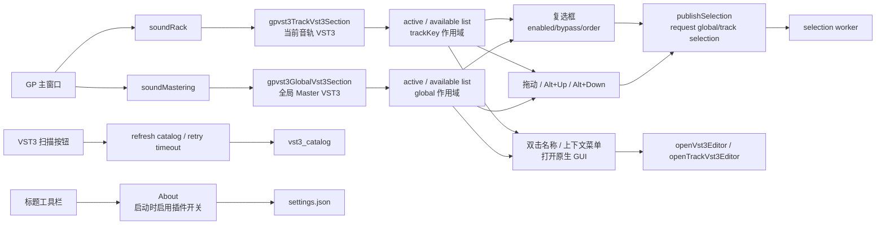

Track 区插入在 GP 的 `soundRack` 后，global 区插入在 `soundMastering` 后；两区独立读取 `effect-chain.json` 的 scope。扫描中的、识别失败的、超时的和缺少 `class_id` 的 bundle 可保留在缓存或 sidecar 中，但不会生成可操作的 UI 行。

## 6. VST3 实例准备与参数通路

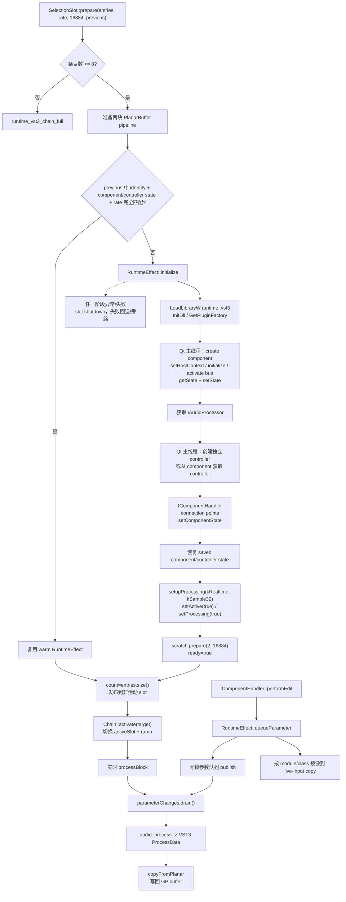

`RuntimeEffect` 的 component/controller 创建、初始化、状态恢复和 editor 相关调用会回到 Qt 主线程；处理器的 `setupProcessing`、scratch 准备和链交接在控制 worker 上完成。实时回调只执行预分配缓冲区和已发布 processor。

## 7. global / Master 实时路径

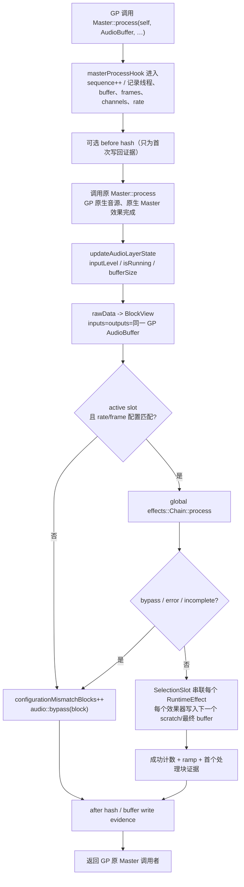

### global 顺序


## 8. track / 音轨实时路径

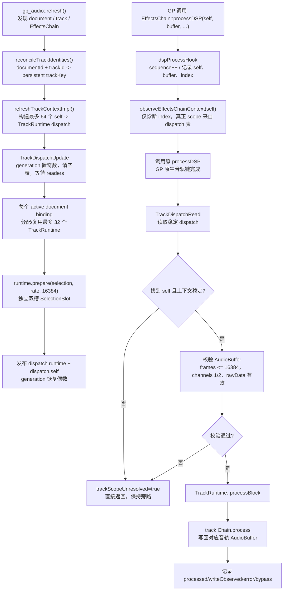

track runtime 只在 `self` 与已发布 binding 匹配时处理。切换音轨、增删音轨、保存/另存、重开或 host 对象重建都会进入 control tick，先保存旧 runtime，再以新的 `trackKey` 重建 dispatch；未解析的上下文安全旁路。

## 9. P4 兼容 live-input / PortAudio 介入路径

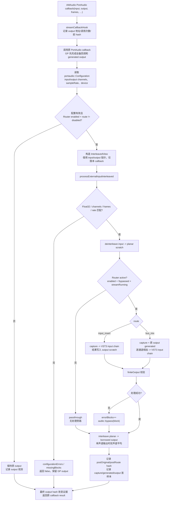

### 两条输入路由的差异

| 路由 | 处理输入 | 处理输出 | 失败行为 | 当前计数 |
| --- | --- | --- | --- | --- |
| `disabled` | 不处理 | 保留 GP 原 output | 不进入 VST3 | `input_bypass_blocks` |
| `input_insert` | 仅 capture | capture 经 input chain 直接写 output | 复制 capture 旁路 | `input_processed_blocks` |
| `bus_mix` | capture + GP 原 output/generated | 混合后经 input chain 写 output | 混合输入旁路 | `input_bus_mixed_blocks` |

默认安装路径不启用 live-input 监听；显式设置 `GPVST3_P4_ROUTE=input_insert|bus_mix` 后才会把选中的 global chain 复制为独立 live-input chain，可改用独立 `GPVST3_RUNTIME_VST3`。

## 10. 双槽切换、实时安全和故障回退

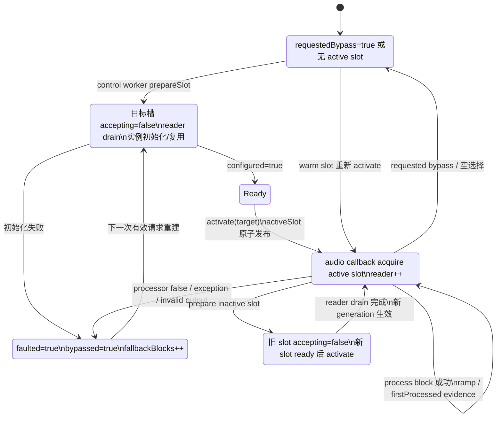

`effects::Chain::process` 的实时分支只有有限两次 acquire 尝试；拿不到稳定 active slot 时直接旁路。插件处理失败会将 chain 标记为 faulted 并旁路当前块，控制路径随后可隔离失败效果器、保存剩余项并重建链。切换的 reader drain 在控制路径执行，实时线程不等待锁。

## 11. 原生 editor 生命周期

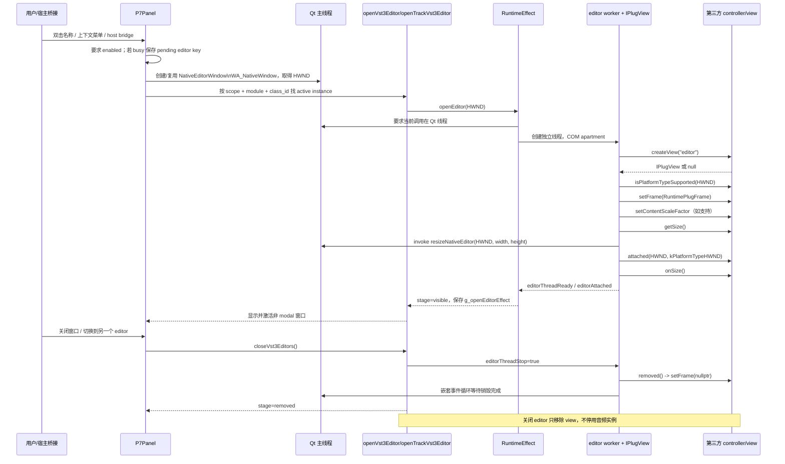

失败阶段写入 `editor_stage`、`editor_result_code`、`editor_error`，包括 `controller_missing`、`create_view`、`platform_check`、`set_frame`、`get_size`、`attached` 和 `removed`。UI 只显示中性文案；识别中的插件会等 control tick 发现 worker 空闲后重试一次 pending key。

## 12. 音轨上下文、文档身份与持久化

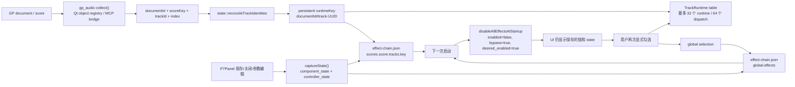

状态文件职责：

| 文件 | 写入时机 | 内容 |
| --- | --- | --- |
| `settings.json` | About 开关 | `enabled`，决定下次启动是否扫描和接入 |
| `effect-chain.json` | 勾选、排序、参数、关闭、退出、runtime retire | schema 2 的 global/track 链、顺序、enabled/bypass、component/controller state、错误 |
| `vst3-catalog-cache.json` | static scan、factory recognition、timeout | 路径指纹、metadata entries、recognition 状态和重试时间 |
| `status.json` | bootstrap 初始化和 scan poll | host、VST3 catalog、hook、UI、adapter 摘要 |
| `p2-observation.json` | 后台合并快照和退出最终 flush | Master/DSP/stream、chain、track、input、selection、editor 时间线和证据 |

## 13. 控制线程、实时线程和 editor 线程关系

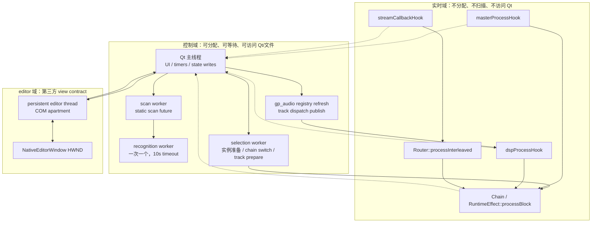

实时线程读取的对象都是控制线程已经发布的固定对象或原子字段：

- global/track/input 各自的 active slot、processor callback 和预分配 scratch；
- `selectionPublished`、`selectionConfiguredRate`、`audioGeneration`、bypass/fault 标志；
- track `self -> TrackRuntime` dispatch 表和 generation/readers 保护；
- input Router 的 route、enabled、streamRunning、配置参数；
- 参数队列中的已发布值。

## 14. 失败、旁路和宿主限制

| 触发条件 | 实时行为 | 控制/诊断行为 |
| --- | --- | --- |
| 宿主 SHA-256 不匹配 | 不安装私有 hook，保持旁路 | `host_unsupported` |
| hook 导出/prologue 不匹配 | 拒绝或回滚 patch | `entry_points_not_found` / `hook_install_failed` |
| 未解析音轨 `self` | 不执行 track runtime | `track_scope_unresolved=true` |
| frames > 16384、channels 非 1/2、rate 不匹配 | 当前块旁路或丢弃 | `configurationMismatchBlocks` / input configuration errors |
| VST3 初始化、state restore、setupProcessing 失败 | 新 slot 不发布，旧链保留；无旧链则旁路 | 失败项写 `last_error`，selection=`failed` |
| VST3 `process` 返回失败或抛异常 | 当前 chain 标记 faulted，当前块 fallback bypass | `errorBlocks`、`fallbackBlocks`，后续可隔离失败项 |
| 输出含非 finite 值 | input 路由回退旁路 | `errorBlocks` |
| reader drain / selection 忙 | 实时线程最多两次 acquire，拿不到就旁路 | 控制 worker 继续处理，UI 保持可操作 |
| editor 无 controller/view/HWND 或 contract 失败 | 音频实例继续运行，editor 不显示 | `editor_stage/result_code/error` |
| 识别超过 10 秒 | 当前 catalog 隐藏该 bundle，队列继续 | detached worker 迟到结果丢弃，缓存标记 timeout |
| 第三方插件进程内崩溃 | 当前实现没有进程级隔离 | 仍属于未实现的隔离能力 |

## 15. 当前实现与证据边界

- 已验证目标：Guitar Pro 8.1.1.17、Windows x64；global/track/live-input 的代码路径、双槽切换、原生 editor 生命周期、状态恢复和识别超时均有专项或 MCP 证据。
- 真实设备矩阵（ASIO/WASAPI）、真实扬声器听感、capture 监听/反馈和其他 Guitar Pro 版本仍受宿主条件限制。
- `status.json` / `p2-observation.json` 中的 `selection_*`、`audio_generation`、`chain_*first_processed*`、`input_*`、`editor_stage/editor_result_code` 是判断“请求已接受、准备完成、已提交、首个有效处理块、输出已改变、editor 可见”的证据入口。
- “DLL 加载成功”“菜单可枚举”“请求返回 true”只表示流程进入了某个阶段，不能单独证明实时 buffer 已写回或真实听感已生效。

## 16. 代码入口索引

| 逻辑 | 文件/符号 |
| --- | --- |
| 自动加载和退出 | `native/vst3_autoload.cpp`：`GuitarProVst3Autoload`、`initializePlugin`、`stopObservation` |
| 启动编排和状态 JSON | `native/modules/bootstrap.cpp`：`initialize`、`pollVst3`、`hookSnapshot` |
| 宿主门控和三个 hook | `native/modules/gp_hook.cpp`：`prepare`、`masterProcessHook`、`dspProcessHook`、`streamCallbackHook` |
| 选择 worker | `native/modules/gp_hook.cpp`：`request*Selection`、`selectionWorkerLoop` |
| 双槽交接 | `native/modules/effect_chain.cpp`：`prepareSlot`、`activate`、`process` |
| VST3 生命周期 | `native/modules/gp_hook.cpp`：`RuntimeEffect::initialize`、`reconfigure`、`processBlock` |
| 输入转换和路由 | `native/modules/input_router.cpp`：`process`、`processInterleaved` |
| track 绑定 | `native/modules/gp_audio_runtime.cpp`：`initialize`、`refresh`、`currentTrack`、`lookup` |
| 扫描与识别 | `native/modules/vst3_catalog.cpp`：`beginAsync`、`poll`、`startNextRecognition`；`vst3_host.cpp`：`identifyBundle` |
| UI 选择/editor | `native/modules/qt_ui.cpp`：`P7Panel::publishSelection`、`openEditor` |
| 持久化和身份 | `native/modules/state_manager.cpp`：`disableAllEffectsAtStartup`、`reconcileTrackIdentities`、`writeChain` |
